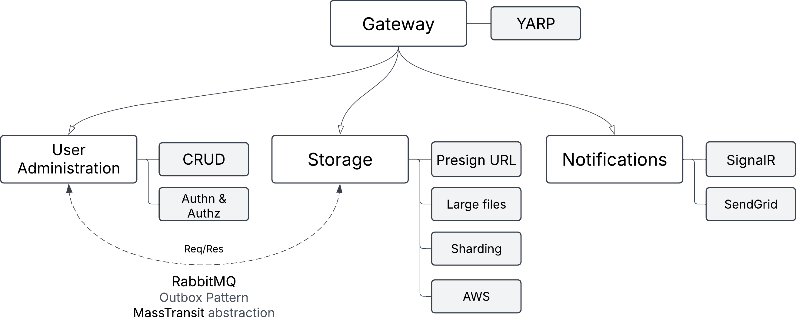

# CloudStore - Cloud Storage Solution

CloudStore is a Google Drive-like cloud storage solution built with .NET, implementing both modular monolith and microservices architectures. The application allows users to store, organize, and manage their files in the cloud with real-time notifications and email updates.

## Architecture

The application is developed in two versions:

### Version 1: Modular Monolith
A modular monolithic application with clear boundaries between modules, using MassTransit and RabbitMQ for internal communication.

Core Modules:
- User Administration (Authentication, Authorization, User Management)
- Storage (File Management, AWS S3 Integration)
- Notifications (Email Services, Real-time Updates)

### Version 2: Microservices
Distributed microservices architecture where each module operates as an independent service, coordinated through an API Gateway (YARP).



## Key Features

### User Administration
- User registration and authentication using JWT
- Account management (CRUD operations)
- Future support for free/premium plans

### Storage
- AWS S3 integration for file storage
- Folder/file structure management
- Support for large file uploads
- Presigned URL generation for secure file access
- Data sharding capabilities

### Notifications
- Email notifications via SendGrid
  - Account verification
  - Password reset
  - Storage capacity warnings
- Real-time notifications via SignalR
  - File upload status
  - File download status
  - File/folder modification updates

## Technical Stack

- **.NET 8**: Core framework
- **YARP**: API Gateway (Version 2)
- **RabbitMQ**: Message broker
- **MassTransit**: Message bus abstraction
- **AWS S3**: File storage
- **SendGrid**: Email service
- **SignalR**: Real-time communications
- **Docker**: Containerization
- **JWT**: Authentication

## Project Structure

### Version 1 (Modular Monolith)
```
BE/
├── src/
│   ├── Modules/
│   │   ├── UserAdministration/
│   │   ├── Storage/
│   │   └── Notifications/
│   └── Api/
│       └── Program.cs
└── tests/
```

### Version 2 (Microservices)
```
BE/
├── src/
│   ├── Modules/
│   │   ├── UserAdministration/
│   │   │   └── Program.cs
│   │   ├── Storage/
│   │   │   └── Program.cs
│   │   └── Notifications/
│   │       └── Program.cs
│   └── Gateway/
└── tests/
```

## Getting Started

### Prerequisites
- .NET 8 SDK
- Docker and Docker Compose
- AWS Account with S3 access
- SendGrid Account

### Development Environment Setup

1. Clone the repository:
```bash
git clone https://github.com/CoekCx/CloudStore.git
cd Cloudstore
cd BE
```

2. Run Docker Compose to start required services:
```bash
docker-compose up -d
```

This will start:
- RabbitMQ
- Other required infrastructure services

3. Configure environment variables:
```bash
cp .env.example .env
```

Edit the `.env` file with your:
- AWS credentials
- SendGrid API key
- Other required secrets

### Running the Application

#### Version 1 (Modular Monolith)
```bash
cd src/Api
dotnet run
```

#### Version 2 (Microservices)
1. Start the Gateway:
```bash
cd src/Gateway
dotnet run
```

2. Start each service:
```bash
cd src/Modules/UserAdministration
dotnet run

cd src/Modules/Storage
dotnet run

cd src/Modules/Notifications
dotnet run
```

## Event Flow

### User Administration Events
- `UserRegistered` → Notifications (Email Verification)
- `PasswordResetRequested` → Notifications (Reset Email)

### Storage Events
- `FileUploaded` → Notifications (Real-time + Email if space low)
- `FileDownloaded` → Notifications (Real-time)
- `FileModified` → Notifications (Real-time)

## Future Enhancements

- File sharing capabilities between users
- Premium user plans with extended features
- Integration with external identity providers

## Docker Support

The application uses Docker for containerization of both the application and its dependencies. Configuration is provided via `docker-compose.yml` for local development and separate Dockerfile for each service in the microservices version.

## License

This project is licensed under the MIT License - see the LICENSE file for details.
